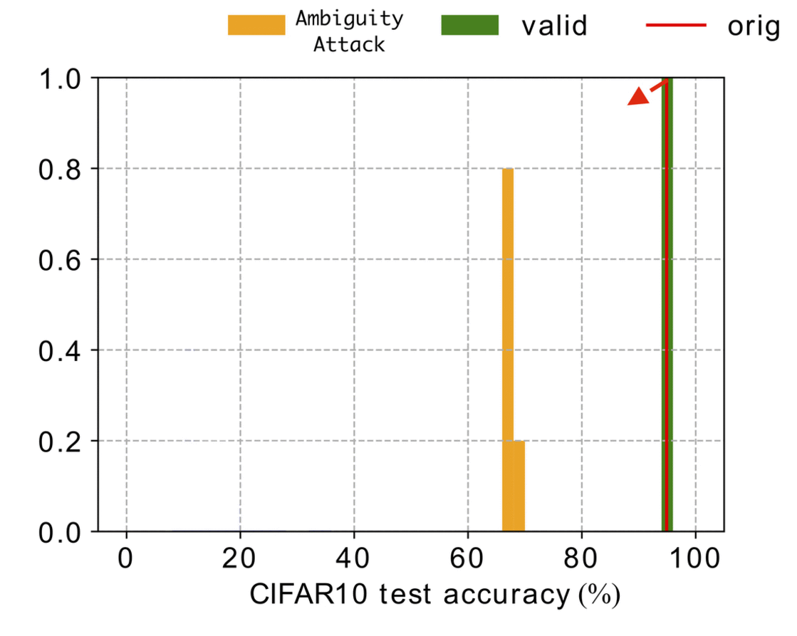

# Deep Network IPR Protection

[Project](https://kamwoh.github.io/DeepIPR/) | [ArXiv](https://arxiv.org/abs/1909.07830) | [PDF](https://doi.org/10.1109/TPAMI.2021.3088846)

### Official pytorch implementation of the paper: 
#### - DeepIP: Deep Neural Network Intellectual Property Protection with Passports (TPAMI 2021)

[TPAMI 2021](https://ieeexplore.ieee.org/document/9454280)

#### - Rethinking Deep Neural Network Ownership Verification: Embedding Passports to Defeat Ambiguity Attacks (NeurIPS 2019)

[NeurIPS 2019](https://proceedings.neurips.cc/paper/2019/hash/75455e062929d32a333868084286bb68-Abstract.html)

Released on September 16, 2019

Updated on June 16, 2021

## Updates
1. Fix bugs
2. Added training and attack bash scripts (see `training.sh` and `attacking.sh`)
3. Added flipping attack (see `flip_attack.py`)
4. Added ImageNet experiment
5. Our framework on GAN IPR protection is also accepted in CVPR 2021, see [Project Repo](https://github.com/dingsheng-ong/ipr-gan).

## Description

<p align="justify"> With the rapid development of deep neural networks (DNN), there emerges an urgent need to protect the trained DNN models from being illegally copied, redistributed, or abused without respecting the intellectual properties of legitimate owners. This work proposes novel passport-based DNN ownership verification schemes which are both robust to network modifications and resilient to ambiguity attacks. The gist of embedding digital passports is to design and train DNN models in a way such that, the DNN model performance of an original task will be significantly deteriorated due to forged passports (see Figure 1). In other words genuine passports are not only verified by looking for predefined signatures, but also reasserted by the unyielding DNN model performances. </p>

<p align="center">     </p>
<p align="center"> Figure 1: Example of ResNet performance on CIFAR10 when (left) Random Attack and (right) Ambiguity Attack </p>

## How to run

For compability issue, please run the code using `python 3.6` and `pytorch 1.2`

If you wish to use a real image as the passport, please ensure that you have a pre-trained model before training the passport layer. 

To see more arguments, please run the script with `--help`.

The example below is running on default arguments.

### To train a normal model (without passport)

Skip `--train-passport` as follow:
```
python train_v1.py
```

### To train a V1 model (scheme 1 passport)

Run `--train-passport` as follow:
```
python train_v1.py --train-passport --pretrained-path path/to/pretrained.pth
```

### To train a V2 model (scheme 2 passport)

Skip `--train-private`, it is true by default.
```
python train_v23.py --pretrained-path path/to/pretrained.pth
```

### To train a V3 model (scheme 3 passport)

Run `--train-backdoor` as follow:
```
python train_v23.py --train-backdoor --pretrained-path path/to/pretrained.pth
```

## Dataset

Most of the datasets will be automatically downloaded except the `trigger set` data.

To download the default `trigger set` data, kindly refer to https://github.com/adiyoss/WatermarkNN

Also, please refer to `dataset.py` to understand how the data are loaded.

## Attack

`passport_attack_1.py`, `passport_attack_2.py`, and `passport_attack_3.py` are the scripts to run fake attack 1, 2 and 3 respectively, as mentioned in our paper.

Please refer to `--help` on how to setup the arguments.

## How to embed passport & signature into a desired layer

All passport configs are stored in `passport_configs/`

To set a passport layer for Alexnet or ResNet18, simply changing `false` to `true` or a `string`.

If `string` is deployed as the signature, please make sure that the length of the string is less than the number of channels in the specific layer.

For example, a layer with 256 channels, so the maximum will be 256-bit === 32 ascii characters are allowed. If the signature is less than 32 characters, the remaining bits will be set randomly.

The example below is AlexNet with the last 3 layers as the passport layer, i.e we embed random signature into the 4th and 5th layer and embed `this is my signature` into the last layer (6th).

```
{
  "0": false,
  "2": false,
  "4": true,
  "5": true,
  "6": "this is my signature"
}
```

For passport in our experiments, we randomly choose 20 images from the test data. Passports in the intermediate layer will be the activation map of 20 images computed from pretrained model.

## Citation
If you find this work useful for your research, please cite
```
@article{Deepipr,
  title={DeepIP: Deep Neural Network Intellectual Property Protection with Passports},
  author={Fan, Lixin and Ng, Kam Woh and Chan, Chee Seng and Qiang, Yang},
  journal={IEEE Transactions on Pattern Analysis and Machine Intelligence},
  year={Accepted},
}
```

```
@inproceedings{Deepassport,
  title={Rethinking Deep Neural Network Ownership Verification: Embedding Passports to Defeat Ambiguity Attacks},
  author={Fan, Lixin and Ng, Kam Woh and Chan, Chee Seng},
  booktitle={Advances in Neural Information Processing Systems (NeurIPS)},
  year={2019},
}
```

## Feedback
Suggestions and opinions on this work (both positive and negative) are greatly welcomed. Please contact the authors by sending an email to
`lixinfan at webank.com` or `kamwoh at gmail.com` or `cs.chan at um.edu.my`.

## License and Copyright
The project is open source under BSD-3 license (see the ``` LICENSE ``` file).

&#169;2019 Webank and University of Malaya.
