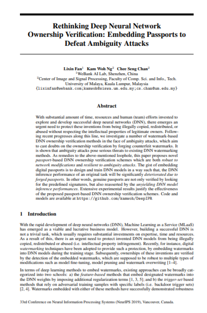
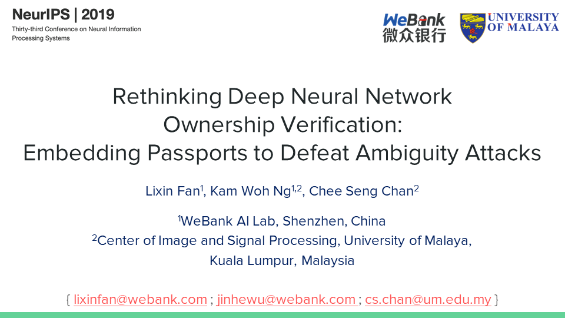

# Deep Learning Intellectual Property Right Protection (DeepIPR)

## Rethinking Deep Neural Network Ownership Verification: Embedding Passports to Defeat Ambiguity Attacks

Authors: 

1. [Lixin Fan](https://scholar.google.fi/citations?user=fOsgdn0AAAAJ&hl=en)<sup>1</sup>
2. [Kam Woh Ng](https://www.linkedin.com/in/thomas-ng-kam-woh/)<sup>1,2</sup>
3. [Chee Seng Chan](http://cs-chan.com/)<sup>2</sup>

[Webank AI Lab](https://webank.com/en/)<sup>1</sup>, [University of Malaya](https://www.um.edu.my/)<sup>2</sup>

Thirty-third Conference on Neural Information Processing Systems (NeurIPS 2019)

## Abstract

With substantial amount of time, resources and human (team) efforts invested to explore and develop successful deep neural networks (DNN), there emerges an urgent need to protect these inventions from being illegally copied, redistributed, or abused without respecting the intellectual properties of legitimate owners. Following recent progresses along this line, we investigate a number of watermark-based DNN ownership verification methods in the face of ambiguity attacks, which aim to cast doubts on the ownership verification by forging counterfeit watermarks. It is shown that ambiguity attacks pose serious threats to existing DNN watermarking methods. As remedies to the above-mentioned loophole, this paper proposes novel passport-based DNN ownership verification schemes which are both robust to network modifications and resilient to ambiguity attacks. The gist of embedding digital passports is to design and train DNN models in a way such that, the DNN inference performance of an original task will be significantly deteriorated due to forged passports. In other words, genuine passports are not only verified by looking for the predefined signatures, but also reasserted by the unyielding DNN model inference performances. Extensive experimental results justify the effectiveness of the proposed passport-based DNN ownership verification schemes.

## Materials

### Paper

<a href="http://papers.nips.cc/paper/8719-rethinking-deep-neural-network-ownership-verification-embedding-passports-to-defeat-ambiguity-attacks" rel="some text"></a>

### Powerpoint Slide

<a href="Digital Passport Slide.pdf" rel="some text"></a>

<!--<a href="https://arxiv.org/abs/1909.07830" style="display:inline-block;margin-right:10px;text-align: center" ><p>Paper</p></a>-->

<!--<a href="Digital Passport Slide.pdf" style="display:inline-block;text-align: center;"><p>Slide</p></a>-->

## Code

<a href="https://github.com/kamwoh/DeepIPR" rel="some text"></a>

<!--<a href="https://github.com/kamwoh/DeepIPR" style="display:inline-block;text-align:center;"><p>Github Repository</p></a>-->

## Citation

```
@inproceedings{Deepassport,
  title={Rethinking Deep Neural Network Ownership Verification: Embedding Passports to Defeat Ambiguity Attacks},
  author={Fan, Lixin, Ng, Kam Woh and Chan, Chee Seng},
  booktitle={Advances in Neural Information Processing Systems (NeurIPS)},
  year={2019},
}
```